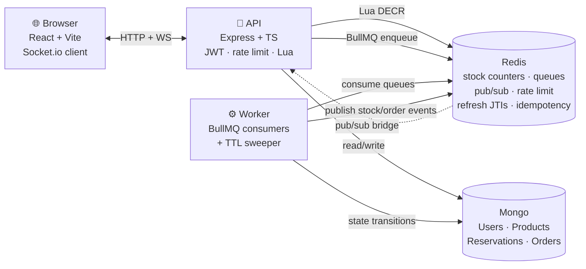

# Flashkart

<!-- Replace OWNER/REPO with your GitHub path after pushing. -->


A real-time flash-sale commerce platform built to **survive the correctness failures that break naïve e-commerce stacks under load**: overselling, retry-driven double-charges, ghost inventory from abandoned carts, ratelimit gaming, and payment-flow desyncs.

Every hard part is backed by a runnable proof script in this repo. Numbers below are the actual observed output.

---

## What's in the box

| # | Crown jewel                                           | Proof                                                                                                       |
|---|-------------------------------------------------------|-------------------------------------------------------------------------------------------------------------|
| 1 | **Zero overselling** under concurrent buyers          | 300 parallel HTTP buys → exactly 50 sold, 0 oversold                                                        |
| 2 | **Idempotent purchases** — retries never double-buy   | 20 parallel requests with same key → 1 real op, 19 replayed                                                 |
| 3 | **TTL reservations** with race-safe expiry            | held → confirmed / expired; sweeper vs confirm race resolves cleanly                                        |
| 4 | **Live stock updates** across api pods and processes  | Buy triggered outside browser → tab updates via Socket.io + Redis pub/sub                                   |
| 5 | **Token-bucket rate limiting** in Redis Lua           | 12 rapid requests → first 5 pass (bucket), next 7 → `429 Retry-After`                                       |
| 6 | **JWT auth with refresh rotation + reuse detection**  | Replay of stale refresh token nukes the whole family                                                        |
| 7 | **Durable async order pipeline** with compensation    | `pending → paid → fulfilled → confirmed` in ~1.25s; forced payment fail → stock returned to pool            |

---

## Architecture



**Split of responsibility**

- **Redis** holds every hot-path bit that must be atomic and fast: live stock counters (with Lua compare-and-decrement), rate-limit buckets, idempotency response cache, refresh-token active-JTI store, BullMQ queues, and the pub/sub bus.
- **Mongo** holds every durable business record: users, products, reservations, orders. Anything with an audit trail or compensation window.
- **API pod** is stateless. All state lives in Redis or Mongo, so pods scale horizontally with no session pinning.
- **Worker pod** runs the reservation sweeper and the three-stage BullMQ order pipeline. Separate deploy unit so payment-processing throughput scales independently of the request path.

---

## The seven proofs

Each script below is runnable with `docker compose exec api npx tsx src/scripts/<name>.ts <args>`.

### 1. No overselling — `buyStorm.ts`

Fires N concurrent HTTP `POST /buy` requests at the real Express route with `X-RateLimit-Bypass` and a minted access token. The atomic Lua script inside `purchase()` guarantees at most one decrement per unit.

```
firing 300 concurrent buys at product 6a5d00b51a93b1e0e09cc34e
stock before: 50

results:
  confirmed (201) : 50
  sold out  (409) : 250
  stock after     : 0

  >> PASS: sold exactly 50 = starting stock, zero oversell.
```

**Where the magic lives:** [`api/src/inventory/inventory.ts`](api/src/inventory/inventory.ts) — Lua script uses a single `GET`+`DECRBY` inside one Redis command, and prime-on-first-touch uses `SET NX` to prevent late-primer resurrection.

### 2. Idempotent purchases — `idempotencyStorm.ts`

Same product, 20 concurrent requests, **same `Idempotency-Key`**. Simulates network-retry or double-click. The winner takes a Redis `SET NX` lock, executes, caches its response; losers short-poll for the winner's result and replay it.

```
firing 20 concurrent buys with SAME key b07fde38-515f-4a81-9501-ce980c7e2aeb
stock before: 20

results:
  201 responses  : 20 / 20
  original run   : 1
  replays        : 19
  stock deducted : 1

  >> PASS: 20 requests, one real purchase, all others replayed.
```

**Where:** [`api/src/idempotency/idempotency.ts`](api/src/idempotency/idempotency.ts) · wired into `/buy` and `/reserve` with per-user namespacing so different users using coincidentally-matching keys don't collide.

### 3. TTL reservations — `reservationDemo.ts`

Three scenarios in one script:

1. **Happy path**: reserve → confirm → stock stays deducted (no phantom refund).
2. **Expiry path**: reserve → force-past-TTL → sweeper reclaims stock → late confirm returns `410 Gone`.
3. **Race**: reserve → simultaneous force-expire + confirm. Whoever wins, the invariants hold: `confirmed` orders never refund stock; `expired` reservations refund exactly once.

**How it's race-safe:** every transition is a single `findOneAndUpdate` with the source status in the predicate. Mongo serialises the two updates; the loser's `$set` is a no-op. Full story in [`api/src/inventory/inventory.ts`](api/src/inventory/inventory.ts) (`confirmReservation`, `releaseReservation`, `sweepExpiredReservations`) and [`worker/src/sweeper.ts`](worker/src/sweeper.ts).

### 4. Live stock updates — verified in-browser

Two tabs open on `/`. Tab A clicks buy. Tab B updates instantly with no reload. Then curl bought from **outside the browser**: still updates. Then a reservation is forced-expired: the worker's sweeper publishes to Redis, api's subscriber emits to the product's Socket.io room, both tabs count back up.

**The scaling point:** we don't emit "in-process" — every stock change goes through Redis pub/sub. When you run 3 api pods behind an ELB, a buy on pod 1 fans out to sockets on pods 2 and 3 via the pub/sub bus. This is what makes horizontally-scaled realtime work.

**Where:** [`api/src/realtime/socket.ts`](api/src/realtime/socket.ts) (bridge) · [`api/src/realtime/stockChannel.ts`](api/src/realtime/stockChannel.ts) (publisher) · dedicated subscriber Redis connection because `SUBSCRIBE` puts a client into subscriber mode.

### 5. Rate limiting — `rateLimitDemo.ts`

Token bucket (capacity 5, refill 0.5/s) in a single Lua script:

```
firing 12 back-to-back buys — bucket = 5 tokens, refill 0.5/s

  # 1  status=201  remaining=4  retryAfter=-s
  # 2  status=201  remaining=3
  # 3  status=201  remaining=2
  # 4  status=201  remaining=1
  # 5  status=201  remaining=0
  # 6  status=429  remaining=0  retryAfter=2s
  # 7  status=429  remaining=0  retryAfter=2s
  ...
  #12  status=429  remaining=0  retryAfter=2s

summary:
  201 confirmed : 5   429 limited : 7
  >> PASS
```

Key is `req.user?.id ?? req.ip` — so authenticated users get per-account limits and shared office IPs don't rate-limit the whole team. Standard `X-RateLimit-Limit` / `X-RateLimit-Remaining` / `Retry-After` headers. Env-gated bypass for load tests.

**Where:** [`api/src/rateLimit/tokenBucket.ts`](api/src/rateLimit/tokenBucket.ts) · [`api/src/rateLimit/middleware.ts`](api/src/rateLimit/middleware.ts).

### 6. Refresh rotation + reuse detection — `refreshReuseDemo.ts`

OAuth 2.0 Security BCP pattern: every refresh mints a new JTI, old JTI is discarded from Redis. Presenting a stale JTI = leaked-token signal → nuke the entire family.

```
  login          : 200  RT0=frt=eyJhbGciOiJIUzI1...
  refresh (RT0)  : 200  RT1=frt=eyJhbGciOiJIUzI1...       (should be 200)
  reuse (RT0)    : 401  refresh token reuse detected      (should be 401)
  legit (RT1)    : 401  session revoked                   (should be 401 — family revoked)

  >> PASS
```

**Design choices worth calling out:**

- Access token: 15 min HS256, in **memory** (React state) — never `localStorage` (XSS-readable).
- Refresh token: 7d HS256, in **httpOnly Secure(prod) SameSite=Lax cookie**, path scoped to `/auth` — unreachable to JS, unreachable cross-site.
- Two separate signing secrets — leaking one doesn't forge the other.
- `typ` claim checked on verify — a stolen access token can't be presented as a refresh token.
- Same error text for unknown-email and wrong-password — no email enumeration via response.

**Where:** [`api/src/auth/tokens.ts`](api/src/auth/tokens.ts) · [`api/src/auth/refreshStore.ts`](api/src/auth/refreshStore.ts) · [`api/src/routes/auth.ts`](api/src/routes/auth.ts).

### 7. Async order pipeline — `orderPipelineDemo.ts` + `orderFailureDemo.ts`

`POST /buy` now returns in ~10ms with `{status:"pending", orderId}`. Three BullMQ workers drive the order through `pending → paid → fulfilled → confirmed` asynchronously.

**Happy path:**

```
firing /buy…
  201  {"status":"pending","orderId":"6a5d144786a221c32e5fa05b","remaining":49}

polling order status:
  t=+0.01s  status=pending
  t=+0.50s  status=paid
  t=+0.98s  status=fulfilled
  t=+1.25s  status=confirmed

>> PASS
```

**Failure path** (worker booted with `FORCE_PAYMENT_FAIL=true`):

```
stock before: 5
stock during: 4  (buy decremented)

  status → pending  attempts=0
  status → failed   attempts=3

final order status: failed  reason=payment declined (forced)
stock after       : 5  (compensated back to pool)

>> PASS
```

**Correctness properties:**

- **At-least-once safe**: every handler starts with a compare-and-set `findOneAndUpdate` predicated on the source status. Duplicate deliveries no-op.
- **Compensation on terminal failure**: `worker.on("failed")` fires on every attempt. We check `job.attemptsMade < JOB_ATTEMPTS` to only compensate on the *terminal* failure. Getting this wrong = duplicate stock returns.
- **Order persisted BEFORE enqueue**: an enqueue failure leaves a visible orphan `pending` order (recoverable). Enqueue-then-persist leaves a silent job with no DB record.

**Where:** [`worker/src/pipeline/orderPipeline.ts`](worker/src/pipeline/orderPipeline.ts) · [`api/src/queues/producers.ts`](api/src/queues/producers.ts) · [`api/src/models/Order.ts`](api/src/models/Order.ts).

---

## Stack

| Layer          | Choice                                        | Why                                                                                                                                            |
|----------------|-----------------------------------------------|------------------------------------------------------------------------------------------------------------------------------------------------|
| API            | Node.js 22 · Express · TypeScript (ESM)       | Fast to iterate, strong types across the monorepo via `@flashkart/shared`                                                                      |
| Auth           | JWT (HS256), bcryptjs, httpOnly refresh cookie | HS256 is right for single-service; interview note: RS256 above ~10 verifying services                                                          |
| Datastore      | MongoDB 7 (durable)                           | Flexible schema for fast iteration; strong compare-and-set primitives for state machines                                                       |
| Hot state      | Redis 7 (AOF `appendfsync everysec`)          | Atomic Lua scripts, pub/sub, BullMQ backend, rate-limit buckets, idempotency cache, refresh-token JTIs                                          |
| Queue          | BullMQ 5                                      | Retries, exponential backoff, DLQ, delayed jobs, per-queue concurrency — all on Redis                                                          |
| Realtime       | Socket.io + Redis pub/sub bridge              | Horizontally-scalable — no sticky sessions needed                                                                                              |
| Web            | React 18 · Vite · Tailwind · socket.io-client | Vite HMR = fast dev; Tailwind = zero-CSS-file styling                                                                                          |
| Infra          | Docker Compose                                | One command to bring the whole stack up locally                                                                                                |
| Validation     | Zod on env AND request bodies                 | Boot-fail-fast on missing env; typed input at handler entry                                                                                    |
| Logging        | Pino + pino-http                              | Structured JSON, low overhead, one line per request                                                                                            |

---

## Run it locally

```bash
docker compose up -d
docker compose exec api npx tsx src/scripts/seed.ts
open http://localhost:5173
```

Register through the UI, click buy. Watch the "My orders" panel transition `pending → paid → fulfilled → confirmed` live.

Then run any of the proofs:

```bash
# Zero overselling under 300 concurrent buyers
docker compose exec -e RATE_LIMIT_BYPASS_TOKEN=dev-bypass-token \
  -e LOAD_TEST_TOKEN=$(docker compose exec -T api npx tsx src/scripts/mintTestToken.ts) \
  api npx tsx src/scripts/buyStorm.ts <productId> 300

# Idempotency
docker compose exec -e RATE_LIMIT_BYPASS_TOKEN=dev-bypass-token \
  -e LOAD_TEST_TOKEN=$(docker compose exec -T api npx tsx src/scripts/mintTestToken.ts) \
  api npx tsx src/scripts/idempotencyStorm.ts <productId>

# Reservations
docker compose exec api npx tsx src/scripts/reservationDemo.ts <productId>

# Rate limiting
docker compose exec api npx tsx src/scripts/rateLimitDemo.ts <productId>

# Refresh rotation
docker compose exec api npx tsx src/scripts/refreshReuseDemo.ts

# Order pipeline (happy)
docker compose exec api npx tsx src/scripts/orderPipelineDemo.ts <productId>

# Order pipeline (payment failure + stock compensation)
docker compose stop worker
docker compose run -d --rm --name flashkart-worker-fail -e FORCE_PAYMENT_FAIL=true worker
docker compose exec api npx tsx src/scripts/orderFailureDemo.ts <productId>
docker stop flashkart-worker-fail && docker compose up -d worker
```

---

## Explicit non-goals

Things I deliberately did **not** build, and would defend that choice in a review:

- **Real payment integration** — payment step is a stub with configurable failure rate. Wiring Stripe adds no new correctness insight and lots of secret-management work.
- **Blockchain / on-chain settlement** — the earlier brief left an optional hash-chained loyalty ledger; scoped out to focus on the crown jewels above.
- **Multi-region / cross-DC replication** — Redis Sentinel and Mongo replica sets are prod concerns, not thesis-level ones for this artifact.
- **CAPTCHA / device fingerprinting** — real bot defence lives at the edge (WAF/CDN); IP + per-user rate limiting is the application layer's part of that stack.
- **RS256 JWT** — would be right at 10+ verifying services. At one, HS256 is simpler and safe.

---

## Interview talking points, condensed

- **Overselling = concurrent read-modify-write.** Fix = one atomic script in Redis. Lua is the "put the state transition inside the DB" trick, applied at every layer: stock decrement, token bucket, idempotency lock, refresh JTI check.
- **Idempotency needs both a lock AND a cache.** Lock alone doesn't help — two racers both find "nothing cached", both execute. Cache alone doesn't help — same problem. `SET NX` + response cache = safe on both duplicate and concurrent duplicate.
- **State-machine correctness comes from predicated updates.** Reservation confirm vs sweeper race is safe because both sides do `findOneAndUpdate({status:"held", ...})`. Whoever lands second has their predicate fail. Same pattern in the order pipeline.
- **Refresh rotation makes token leaks self-heal.** Any use of a stale JTI nukes the family — no separate breach-monitoring system needed for the token layer.
- **Async pipelines break at compensation.** Async is easy on the happy path; the interesting question is "what state stays consistent when step 3 of 5 fails after step 2 already committed?" We compensate the stock decrement on payment failure via the same status-gated update.
- **The Redis pub/sub bridge is what makes realtime scale.** In-process emit works with 1 pod; horizontal scale requires an out-of-process bus. Building it manually here (rather than using `@socket.io/redis-adapter`) makes the mechanism visible.

---

## Layout

```
/api                        Express + TS HTTP service
  src/inventory/            atomic Lua stock decrement, reservations
  src/idempotency/          Redis-lock replay cache
  src/rateLimit/            Lua token bucket + Express middleware
  src/auth/                 JWT sign/verify, refresh JTI store, bcrypt
  src/realtime/             Socket.io + Redis pub/sub bridge
  src/queues/               BullMQ producers
  src/routes/               auth, products, reservations, orders
  src/scripts/              proof scripts (referenced above)
/worker                     BullMQ consumers
  src/sweeper.ts            TTL reservation reclaim
  src/pipeline/             three-stage order pipeline + payment stub
/web                        React + Vite SPA
/packages/shared            error taxonomy, roles, queue names, event shapes
```
